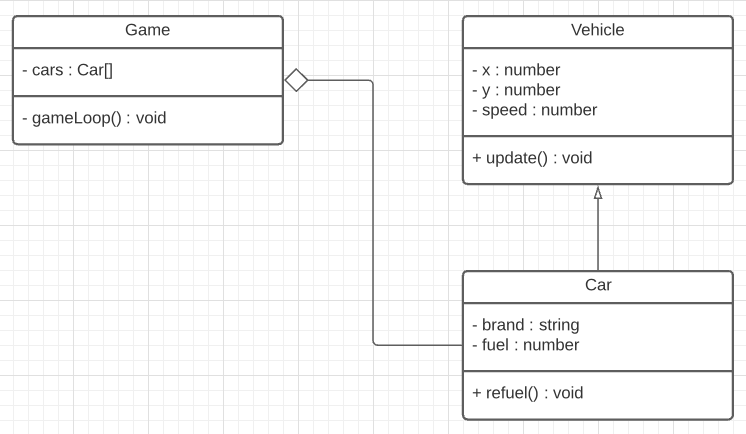

# Typescript

Informatie voor het vak CMTTHE01-4, Game programming en Typescript.

- <a href="#curry">Curriculum</a>
- <a href="#work">Werkomgeving</a> en [startproject](https://github.com/HR-CMGT/Typescript-startproject)
- <a href="#speed">Speed courses</a>
- <a href="#games">Game development basics</a>
- <a href="#advanced">Game development advanced</a>
- <a href="#list">Reading list</a>

<br>
<br>
<br>

# <a name="curry"></a> Curriculum

Op [Cumlaude CMTTHE01-4](https://lms.hr.nl) vind je de cursushandleiding

- [Week 1](https://github.com/HR-CMGT/CMTTHE04-Week1-oefening1) - Objects. Project kiezen en aanmelden in github classroom.
- [Week 2](https://github.com/HR-CMGT/CMTTHE04-Week2-oefening1) - Classes en Instances
- [Week 3](https://github.com/HR-CMGT/CMTTHE04-Week3-oefening1) - Encapsulation, Game Loop, Collision detection
- [Week 4](https://github.com/HR-CMGT/CMTTHE04-2021-Week4-oefening1) - Composition
- Week 5 - Inheritance
- Week 6 - ⚠️ **DEADLINE** klassendiagram, OOP werkcollege
- Week 7 - Game techniques
- Week 8 - Game techniques
- Week 9 - ⚠️ **DEADLINE** Opdracht inleveren


<br>
<br>

# <a name="work"></a>Werkomgeving

- Installeer [NodeJS](https://nodejs.org/en/), [Typescript](https://www.typescriptlang.org) en [Visual Studio Code](https://code.visualstudio.com)
- Installeer de [live server](https://marketplace.visualstudio.com/items?itemName=ritwickdey.LiveServer) plugin voor Visual Studio Code.
- Je kan testen of alles werkt met het [Typescript startproject](https://github.com/HR-CMGT/Typescript-startproject), en je kan meer info vinden in het [quickstart document](./PRG01-4_quickstart.pdf)

### ⚠️ Let op voor Windows gebruikers
Run PowerShell as Administrator (rechtermuisklik op PowerShell) en voor het volgende commando uit
```
Set-ExecutionPolicy -ExecutionPolicy RemoteSigned
```

## Klassendiagram

Je kan met [Lucid Charts](http://lucid.app/) een klassendiagram tekenen voor je game. Hier zie je een voorbeeld van een class diagram met *composition, encapsulation en inheritance*



<br>
<br>

# <a name="speed"></a> Speed courses

- [Game loop](https://github.com/HR-CMGT/CLE-speedcourses/tree/master/gameloop)
- [Sprites](https://github.com/HR-CMGT/CLE-speedcourses/tree/master/sprites)

<br>
<br>

# <a name="games"></a> Game development basics

- [HTML en CSS basics](snippets/html.md)
- [Game Loop](snippets/game.md)
- [Besturing](snippets/movement.md)
- [Collision detection](snippets/collision.md)
- [Timer](snippets/timer.md)
- [Object Pool](snippets/pool.md)

<br>
<br>

# <a name="advanced"></a> Game development advanced

- [Scrolling background](snippets/scrolling.md)
- [Startscherm en eindscherm](screens/screen.md)
- [EventListeners en Intervals verwijderen](snippets/remove.md)
- [Spritesheet](snippets/spritesheet.md)
- [Touch events](snippets/touch.md)
- [Custom Events](snippets/events.md)
- [Moving along a path](snippets/path.md)
- [Vector](snippets/vector.md)
- [Drag and drop](snippets/drag.md)
- [Modules](snippets/modules.md)
- [Web Components](snippets/webcomponents.md)
- [Matter Physics](https://github.com/KokoDoko/physics-typescript)
- [3D with ThreeJS](https://github.com/KokoDoko/threejs-typescript)
- [Debugging in VS Code](snippets/debug.md)
- [State Manager](snippets/state.md)
- [Connecting a controller](https://github.com/HR-CMGT/arcade-game) and [MDN Docs](https://developer.mozilla.org/en-US/docs/Web/API/Gamepad_API/Using_the_Gamepad_API)

<br>
<br>
<br>
<br>
<br>
<br>
<br>
<br>

---

# <a name="list"></a> Reading list

## Tutorials en API's

- [JSON en Fetch in Typescript](snippets/fetch.md)
- [Physics Tutorial met MatterJS en Typescript](https://github.com/KokoDoko/physics-typescript)
- [Socket.io Multiplayer](https://socket.io)
- [Lance Multiplayer Server](http://lance.gg)
- [SAT.JS : collision detection for complex shapes](https://github.com/jriecken/sat-js)
- [QuadTree : large scale collision detection](https://github.com/timohausmann/quadtree-js)
- [Particle Engine](https://vincentgarreau.com/particles.js/)
- [RPG Conversation Tree](https://github.com/google/bottery)
- [Touch Gestures Library](https://hammerjs.github.io)
- [Matter 2D physics](http://brm.io/matter-js/)
- [Planck 2D physics](http://piqnt.com/planck.js/Car)
- [SVG Vector drawing](http://svgjs.com)
- [AI / Deep Learning](https://deeplearnjs.org)
- [Greensock Tweening](https://greensock.com)
- [Multithreading in Javascript](https://keithwhor.github.io/multithread.js/)
- [Dependency Injection](https://www.npmjs.com/package/container-ioc)
- [Boardgame.io](http://boardgame.io/#/) - build a boardgame in Javascript
- [Phaser 3 Typescript workshop](https://github.com/HR-CMGT/CLE4-phaser-workshop)
- [Phaser 3 Typescript Game Examples](https://github.com/digitsensitive/phaser3-typescript)
- [Phaser Tutorials Flavio Copes](https://flaviocopes.com/tags/phaser/)
- [Build Flappy Bird in 5 minutes with Phaser and Typescript](https://medium.com/@digit.sensitivee/learn-to-create-a-html5-game-in-5-minutes-604118f5d0ab) en [Source code](https://github.com/digitsensitive/phaser3-flappy-bird)
- [Course on Object Oriented Programming in Javascript](https://codewithmosh.com/p/object-oriented-programming-in-javascript)

## Workshops

- [🔥 Workshop Phaser 3 met Typescript](https://github.com/HR-CMGT/CLE4-phaser-workshop)
- [🔥 Workshop P5 with Typescript](https://github.com/HR-CMGT/CLE4-P5-workshop/tree/master/p5-typescript)
- [Typescript workshop Giuseppe Maggiore 7/1/2019](snippets/types.md)
- [Robot Royale - Online Multiplayer Game with Typescript and Socket.io](https://github.com/HR-CMGT/robot-royale)

## Graphics

- [Open Game Art](https://opengameart.org/)
- [Kenny.nl](http://kenney.nl/)
- [Spriters Resource](https://www.spriters-resource.com/)
- [Retro Game Zone](https://retrogamezone.co.uk/)
- [Assets Forge](http://assetforge.io/) - maak 2D sprites op basis van building blocks
- [Making Voxel art](https://ephtracy.github.io/)

## Audio

- [Voorbeeld audio tag en Howler](snippets/audio.md)
- [Howler Documentation](https://howlerjs.com)
- [Web Audio API](https://developer.mozilla.org/en-US/docs/Web/API/Web_Audio_API)	
- [Speech API](https://developer.mozilla.org/en-US/docs/Web/API/Web_Speech_API)
- [Synthesizer API](https://developer.mozilla.org/en-US/docs/Web/API/OscillatorNode)

## Canvas/WebGL

- [Canvas en Spritesheets](snippets/canvas.md)
- [P5.js Creative Coding Library](https://p5js.org)
- [Pixi Canvas Basics](snippets/pixi.md) en [Library](http://www.pixijs.com)
- [Phaser 3 Typescript](https://github.com/digitsensitive/phaser3-typescript) en [example games](https://github.com/digitsensitive/phaser3-typescript/tree/master/src/games)
- [Isomer for Isometric games](http://jdan.github.io/isomer/)
- [3D animatie](https://threejs.org) en [3D scene editor](https://threejs.org/editor/)
- [AR for ThreeJS](https://github.com/jeromeetienne/AR.js)
- [CreateJS 2D](http://createjs.com)

## Documentation

- [Typescript in 5 minutes](https://www.typescriptlang.org/v2/docs/handbook/typescript-in-5-minutes.html)
- [Official documentation](https://www.typescriptlang.org/docs/home.html)
- [The definitive Typescript guide](https://www.sitepen.com/blog/update-the-definitive-typescript-guide/)


## Type definitions

Om javascript libraries te gebruiken in een typescript project heb je Type Definitions nodig. Dit zijn `.d.ts` files. Er staan een aantal voorbeelden in [deze repository](https://github.com/HR-CMGT/Typescript/tree/master/definitions). Je kan type definitions ook via `npm` downloaden:

`npm install @types/libraryname`
