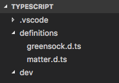
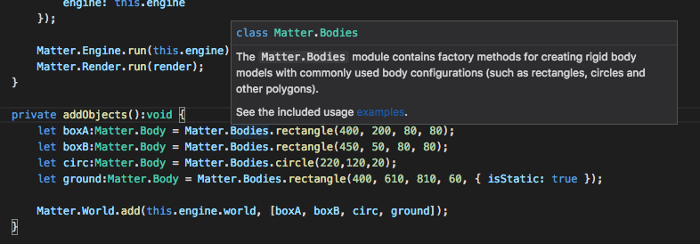

## Types toevoegen voor libraries

Als je met externe libraries werkt dan herkent je werkomgeving niet automatisch alle types. Je krijgt dan geen autocompletion en je kan niet aangeven welk type een instance moet zijn. Daarom moet je een code definition file toevoegen voor externe libraries. Deze plaats je in een eigen map. Zie screenshot.

In deze repository staat een folder met definition files.

Je krijgt nu code completion en documentation in je werkomgeving.

Voor je eigen libraries kan je een declaration file genereren door in tsconfig.json `"declaration": true` te plaatsen.

## Links

- [Type definition files op GitHub](https://github.com/DefinitelyTyped/DefinitelyTyped)
- [Type definition files via NPM install](https://www.npmjs.com/~types)
- [TSconfig opties](https://www.typescriptlang.org/docs/handbook/compiler-options.html)