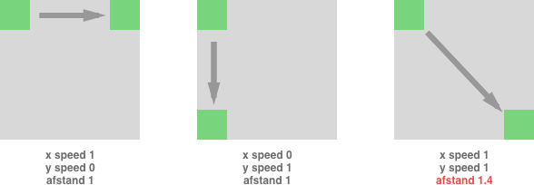
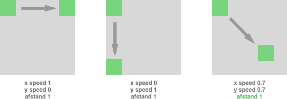

# Vector Math
Een [Vector2](./vector2.ts) is een object met een x en y waarde:

### Voorbeeld
```
let position:Vector2 = new Vector2(200,300);

// game loop
div.style.transform = "translate(" + position.x + "px, " + position.y + "px)";
```

## Vectoren vergelijken
Een vector heeft een aantal ingebouwde 'convenience methods'.
```
let v1 = new Vector2(20,35);
let v2 = new Vector2(100,120)

// optellen
v1 = v1.add(v2);

// verschil tussen twee vectoren
let diff = v1.difference(v2);

// de lengte van deze vector
let v3 = new Vector2(100,100);
let distance = v3.magnitude();    // resultaat 141.42135
```

### Voorbeeld
```
let position = new Vector2(200,300);
let speed = new Vector2(4,3);

// game loop
position = position.add(speed);
```

## Richting bepalen
Als een object kan draaien en in een bepaalde richting kan bewegen, dan kan je vectoren gebruiken in plaats van rotation en degrees/radians. Ook als je object niet roteert maar wel een x en y snelheid heeft, dan kan het beter zijn om met vectoren te werken. In dit voorbeeld zie je drie objecten met een x en een y snelheid. Je ziet dat het object met een x én y snelheid van 1 meer afstand aflegt. In een spel zoals Pong zou het logischer zijn als de bal altijd evenveel afstand aflegt, ongeacht de richting waarin de bal beweegt.



### Normalize
Normalize vertaalt een x,y snelheid naar een afstand die je aflegt met die snelheid.
```
let position = new Vector2(300,200);
let speed = new Vector2(1,1);
let normalizedSpeed = speed.normalize();      // result 0.70710

// game loop
position = position.add(normalizedSpeed);
```



# Rectangle 
Een Rectangle is een object met een x,y positie (een Vector2) en een breedte en hoogte.
```
let rect:Rectangle = new Rectangle(new Vector2(20,20), 100, 100);
```

## Rectangle collision
Een Rectangle heeft methods om te zien of er een collision is
```
//
// Kijk of een punt (een vector) binnen de rectangle is
//
let r1:Rectangle = new Rectangle(new Vector2(20,20), 100, 100);
let v7:Vector.Vector2 = new Vector2(25,25);
let hit:boolean = r1.isInside(v7);

//
// Kijk of twee rectangles overlappen
//
let r2:Rectangle = new Rectangle(new Vector2(30,30), 200, 150);
let hit2 = r1.isOverlap(r2);
```
